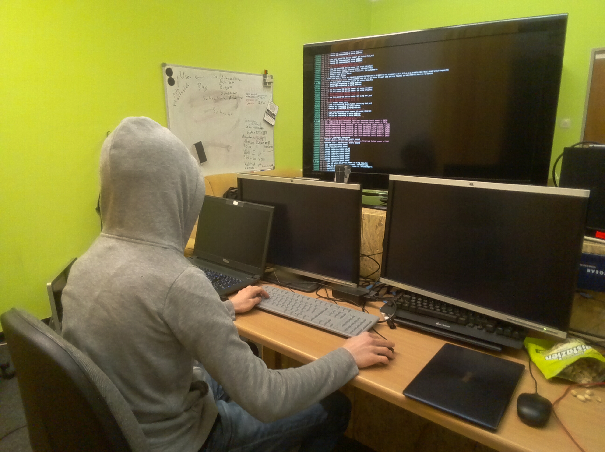

# Hackerspace

Ein Hackerspace (von Hacker und Space, engl. für Raum) oder Hackspace ist ein physischer, häufig offener Raum, in dem 
sich Hacker sowie an Wissenschaft, Technologie oder digitaler Kunst Interessierte treffen und austauschen können.

Typische Aktivitäten sind Basteleien, Do-it-yourself Workshops, Präsentationen, Vorträge, soziale Aktivitäten wie das 
Teilen von Wissen und gemeinsames Lernen sowie die Organisation von Partys und Spielen. Hackerspaces stellen hierfür
eine Infrastruktur bereit, vor allem Strom, Internetzugang, Netzwerkverbindungen, Werkzeuge und Getränke
(meist Mate oder Spezi).

Wer nach einem Hackerspace in Pfaffenhofen sucht, Interesse hat sich mit 
Technikinteressierten auszutauschen und an verschiedenen Hard- & Softwareprojekten teilzunehmen wendet sich 
an .

