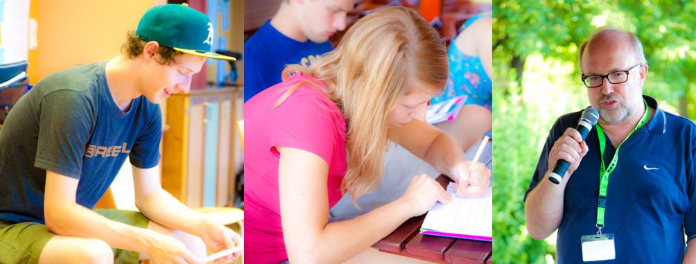

# Radio

Das Radio Team hat sich gleich für den Anfang ein sehr ehrgeiziges Projekt vorgenommen. 
Ein eigenes Bürgernetz WEBRADIO ist das Ziel. Unser Webradio sollte auch noch eine
semiprofessionelle Qualität aufweisen.

Für das Webradio sind viele Schritte nötig:

Unsere Technikgruppe vom Bürgernetz bekommt den Auftrag sich um das Streaming zu kümmern.

Die Moderatoren werden in Sprechtechnik, Phonetik, Interview- und Beitragsgestaltung ausgebildet werden.
Vier Scouts waren 9 Tage auf der Radio Sommerakademie 2012 in der Nähe von Graz und haben dort eine Woche echtes
UKW-Radio gemacht. So wurde der Grundstein gelegt.

Die Zielgruppe ist einfach zu definieren, jeder der sprechen will und kann, darf sich melden, also keine 
Altersbeschränkungen.

Nicht erlaubt ist Politik, ansonsten kann jeder Bürger, auch jeder Verein oder gemeinnützige Institution an diesem 
Projekt mitarbeiten.  
… und jetzt meldet euch bitte so zahlreich wie möglich, wird brauchen viele, viele Helfer. 
Per Mail an  oder auch einfach anrufen unter 0170 3800858.